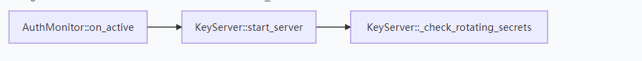
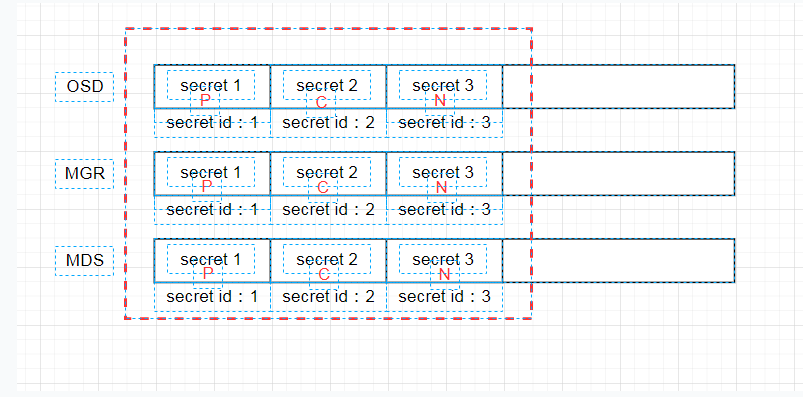

# 问题
现象：一个osd一直是down，osd的状态一直在boot


osd的日志只有tick，打开osd的ms日志，可以看到osd一直在发送auth认证

# 分析
- 1.ceph -s是能看到mon是有时钟偏移的

查看我们osd所连接的mon查看日志，是一个非leader mon，刚开始只开了ms日志，看不出啥，只有一直auth请求重试，然后打开paxos日志，可以看到相关信息

一个是时间，now和lease_expire，now比lease_expire还大，也就是当前时间比租约过期时间还大，也就是一个无效的时间段，那这个时候非leader mon会被标记为不可读
- 2.代码如下
```
bool Paxos::is_readable(version_t v)
{
  bool ret;
  if (v > last_committed)
    ret = false;
  else
    ret =
      (mon->is_peon() || mon->is_leader()) &&
      (is_active() || is_updating() || is_writing()) &&
      last_committed > 0 && is_lease_valid(); // must have a value alone, or have lease
  dout(5) << __func__ << " = " << (int)ret
	  << " - now=" << ceph_clock_now()
	  << " lease_expire=" << lease_expire
	  << " has v" << v << " lc " << last_committed
	  << dendl;
  return ret;
}
```
其中is_lease_valid函数如下
```
bool Paxos::is_lease_valid()
{
  return ((mon->get_quorum().size() == 1)
      || (ceph_clock_now() < lease_expire));
}
```
不可读之后，请求会被加入wait等待
```
bool PaxosService::dispatch(MonOpRequestRef op){
  ...
  if (!is_readable(m->version)) {
    dout(10) << " waiting for paxos -> readable (v" << m->version << ")" << dendl;
    wait_for_readable(op, new C_RetryMessage(this, op), m->version);
    return true;
  }
  ...
}
```
- 3.从admin sock我们也可以看到所有正在处理的op

而且这个mon的内存也比较多

其他mon都是600M
