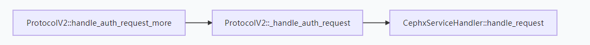
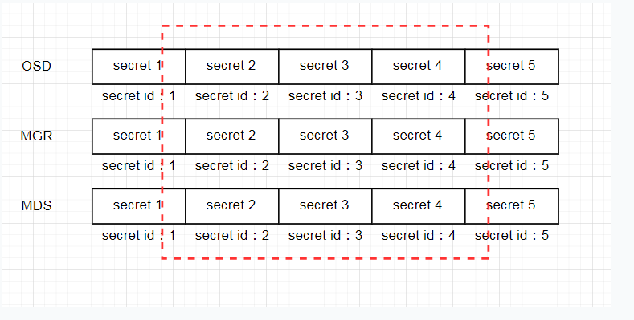

# 1.周期任务
周期性任务是指每隔指定时间运行一次指定任务，跟linux下面的crontab类似，那nova里面也有很多周期性的任务，比如周期性同步虚拟机的电源状态，周期信息上报计算节点的信息，这些都是在nova-compute服务做的，那这又是怎么实现的呢？

# 2.从nova-compute服务启动说起
对于周期性的任务的启动，如果是你，你准备在哪里启动他们，思考3秒
1
2
3
好，应该是在nova-compute服务启动的时候就启动这些周期性的任务，至于这些任务是以何种方式运行，比如是以脱离nova-compute进程的外部进程(exec),还是子进程，还是以一个线程又或者是一个协程？我们来具体看一下。
- 1.从cmd看服务启动流程
nova的所有服务都从cmd目录下面启动，nova-compute也不例外
main函数如下
```
def main():
    config.parse_args(sys.argv)
    logging.setup(CONF, 'nova')
    utils.monkey_patch()
    objects.register_all()

    gmr.TextGuruMeditation.setup_autorun(version)

    if not CONF.conductor.use_local:
        block_db_access()
        objects_base.NovaObject.indirection_api = \
            conductor_rpcapi.ConductorAPI()

    server = service.Service.create(binary='nova-compute',
                                    topic=CONF.compute_topic,
                                    db_allowed=CONF.conductor.use_local)
    service.serve(server)
    service.wait()
```
可以看出主要是生成一个service服务对象，这个对象是openstack抽出来的一个基础类，一个类代表一个服务，比如nova-api，nova-compute，这个有很多人已经分析过了，可以google一下
这里要注意我们要关注的是在创建service对象的时候，它有一个manager成员比较重要，我们来具体看一下
```
@classmethod
def create(cls, host=None, binary=None, topic=None, manager=None,
           report_interval=None, periodic_enable=None,
           periodic_fuzzy_delay=None, periodic_interval_max=None,
           db_allowed=True):

    if not host:
        host = CONF.host
    if not binary:
        binary = os.path.basename(sys.argv[0])
    if not topic:
        topic = binary.rpartition('nova-')[2]
    if not manager:
        manager_cls = ('%s_manager' %
                       binary.rpartition('nova-')[2])
        manager = CONF.get(manager_cls, None)
    if report_interval is None:
        report_interval = CONF.report_interval
    if periodic_enable is None:
        periodic_enable = CONF.periodic_enable
    if periodic_fuzzy_delay is None:
        periodic_fuzzy_delay = CONF.periodic_fuzzy_delay

    debugger.init()

    service_obj = cls(host, binary, topic, manager,
                      report_interval=report_interval,
                      periodic_enable=periodic_enable,
                      periodic_fuzzy_delay=periodic_fuzzy_delay,
                      periodic_interval_max=periodic_interval_max,
                      db_allowed=db_allowed)

    return service_obj
```
manager主要是nvoa-compute的业务处理入口，这个是在service初始化函数的时候，是通过类的动态函数加载的
```
def __init__(self, host, binary, topic, manager, report_interval=None,
             periodic_enable=None, periodic_fuzzy_delay=None,
             periodic_interval_max=None, db_allowed=True,
             *args, **kwargs):
    ....
    self.manager_class_name = manager
    ....
    manager_class = importutils.import_class(self.manager_class_name)
    self.manager = manager_class(host=self.host, *args, **kwargs)
    ....
```
这个manager对应的代码其实就是ComputeManager函数

除了manager之外，还有一个periodic_enable属性,用来指示这个service支持周期性事件
```
periodic_enable = CONF.periodic_enable
```
上面会在service创建完之后，serve服务，就是启动服务，我们跟踪代码

- 2.服务start分析
service函数如下
```
def start(self):

    ...
    if self.periodic_enable:
        if self.periodic_fuzzy_delay:
            initial_delay = random.randint(0, self.periodic_fuzzy_delay)
        else:
            initial_delay = None

        self.tg.add_dynamic_timer(self.periodic_tasks,
                                 initial_delay=initial_delay,
                                 periodic_interval_max=
                                    self.periodic_interval_max)
```
过滤掉跟周期性调度无关的，可以看到如果service支持周期事件，则会在tg这个协程组中增加一个动态定时器，这个定时器就是用来做周期性任务的，可以看到定时器调用的是self.periodic_tasks，这个函数调用流程如下：

可以有人会问PeriodicTasks是个啥，嗯，好吧，是时候亮出我的python本事了，解释一下nova的周期性事件调度框架

- 3.manager继承关系
我一般比较喜欢看类的继承关系，通过继承关系能看项目的一个数据大概，想当年看ceph代码的时候就是靠着类的继承关系（好像扯远了）

可以看到，我们nova的Computemanager间接继承了PeriodicTasks，是我们的compute的管理对象具有周期调度的能力，中间manager是服务管理对象的基类，nova api，conductor都会有一个，所以上面的periodic_tasks最终会调度到PeriodicTasks这个父类的方法中
```
def run_periodic_tasks(self, context, raise_on_error=False):
    """Tasks to be run at a periodic interval."""
    idle_for = DEFAULT_INTERVAL
    for task_name, task in self._periodic_tasks:
        full_task_name = '.'.join([self.__class__.__name__, task_name])

        spacing = self._periodic_spacing[task_name]
        last_run = self._periodic_last_run[task_name]

        # Check if due, if not skip
        idle_for = min(idle_for, spacing)
        if last_run is not None:
            delta = last_run + spacing - time.time()
            if delta > 0:
                idle_for = min(idle_for, delta)
                continue

        LOG.debug("Running periodic task %(full_task_name)s",
                  {"full_task_name": full_task_name})
        self._periodic_last_run[task_name] = _nearest_boundary(
            last_run, spacing)

        try:
            task(self, context)
        except Exception as e:
            if raise_on_error:
                raise
            LOG.exception(_LE("Error during %(full_task_name)s: %(e)s"),
                          {"full_task_name": full_task_name, "e": e})
        time.sleep(0)

    return idle_for
```
可以看出这个代码就是循环调用周期函数，然后执行
这里有一个问题周期性的函数怎么注册的呢，我们可以看到Computemanager类中，很多函数有这个装饰器periodic_task.periodic_task
```
@periodic_task.periodic_task
def _check_instance_build_time()
```
这有什么用呢，好我们分析一下周期任务框架
- 4.周期任务框架
## 4.1周期任务注册
就是使用上面提到的periodic_task.periodic_task装饰器对一个普通的函数进行注册就可以变成周期性任务函数，可以看一下装饰器函数
```
def periodic_task(*args, **kwargs):

    def decorator(f):
        # Test for old style invocation
        if 'ticks_between_runs' in kwargs:
            raise InvalidPeriodicTaskArg(arg='ticks_between_runs')

        # Control if run at all
        f._periodic_task = True
        f._periodic_external_ok = kwargs.pop('external_process_ok', False)
        if f._periodic_external_ok and not CONF.run_external_periodic_tasks:
            f._periodic_enabled = False
        else:
            f._periodic_enabled = kwargs.pop('enabled', True)
        f._periodic_name = kwargs.pop('name', f.__name__)

        # Control frequency
        f._periodic_spacing = kwargs.pop('spacing', 0)
        f._periodic_immediate = kwargs.pop('run_immediately', False)
        if f._periodic_immediate:
            f._periodic_last_run = None
        else:
            f._periodic_last_run = time.time()
        return f

        return decorator
    else:
        return decorator(args[0])
```
函数很简单的就是给普通的函数增加了一些属性，可以周期调度的属性，这个是用了python中一切都是对象的特性，对象都可以增加属性

## 4.2周期任务的加载
通过上面4.1周期性任务注册之后，任务是怎么加载到Computemanager的呢？
我们注意到
```
@six.add_metaclass(_PeriodicTasksMeta)
class PeriodicTasks(object):
```
PeriodicTasks这个类有一个元类，嗯，使用到了python的元编程，一般元类用来可以改变类对象的构造方法，python中的构造方法和初始化方法可以google，这里不是重点
```
class _PeriodicTasksMeta(type):
    ...
    def __init__(cls, names, bases, dict_):
        ....
        for value in cls.__dict__.values():
            if getattr(value, '_periodic_task', False):
                cls._add_periodic_task(value)
```
这里面的\__init__就是构造方案，就是在生成PeriodicTasks类对象的构造方法，也是生成Computemanager类对象的构造方法，里面有一个_add_periodic_task函数，嗯，这就是把周期性任务函数加入Computemanager的地方，这里的cls不是指代PeriodicTasks类，而是Computemanager,cls.\__dict__这个可以找到一个类的所有属性，包括变量和方法，我们上面注册看到，周期性的方法是增加了_periodic_task属性，所以getattr(value, '\_periodic_task', False)这个函数就是捞出周期性任务
```
def _add_periodic_task(cls, task):

    if task._periodic_spacing < 0:
        LOG.info(_LI('Skipping periodic task %(task)s because '
                     'its interval is negative'),
                 {'task': name})
        return False
    if not task._periodic_enabled:
        LOG.info(_LI('Skipping periodic task %(task)s because '
                     'it is disabled'),
                 {'task': name})
        return False

    if task._periodic_spacing == 0:
        task._periodic_spacing = DEFAULT_INTERVAL

    cls._periodic_tasks.append((name, task))
    cls._periodic_spacing[name] = task._periodic_spacing
    return True
```
可以看出加入任务主要是在Computemanager对象中增加三个缓存对象_periodic_tasks,\_periodic_spacing,以及下面的_periodic_last_run,分别代表任务队列，每个任务的执行间隔，每个任务的上次运行时间点，使用的dict存储
说到这里我们大致知道，在service服务对象创建的时候会生成computemanager对象，生成这个对象的时候会把这个类中使用periodic_task.periodic_task装饰的任务注册到computemanager对象的三个缓存dict中，然后再在service.start启动的时候，会根据是否本服务支持周期任务调度，在协程池中增加一个动态定时器，这个定时器会有周期性的调度在computermanager中注册的周期性任务

- 5.周期任务是跑在线程还是协程
那么这些周期任务是怎么运行的呢？这个就需要我们去看一下那个动态定时器
```
def add_dynamic_timer(self, callback, initial_delay=None,
                      periodic_interval_max=None, *args, **kwargs):
    timer = loopingcall.DynamicLoopingCall(callback, *args, **kwargs)
    timer.start(initial_delay=initial_delay,
                periodic_interval_max=periodic_interval_max)
    self.timers.append(timer)
```
可以看出定时器就是一个loopcall，只不过是会根据任务指定的时间间隔进行周期性的调度，进入timer.start函数看一下周期性任务是怎么运行的
```
def start(self, initial_delay=None, periodic_interval_max=None):
    self._running = True
    done = event.Event()

    def _inner():
        if initial_delay:
            greenthread.sleep(initial_delay)

        try:
            while self._running:
                idle = self.f(*self.args, **self.kw)
                if not self._running:
                    break

                if periodic_interval_max is not None:
                    idle = min(idle, periodic_interval_max)
                LOG.debug('Dynamic looping call %(func_name)r sleeping '
                          'for %(idle).02f seconds',
                          {'func_name': self.f, 'idle': idle})
                greenthread.sleep(idle)
        except LoopingCallDone as e:
            self.stop()
            done.send(e.retvalue)
        except Exception:
            LOG.exception(_LE('in dynamic looping call'))
            done.send_exception(*sys.exc_info())
            return
        else:
            done.send(True)

    self.done = done

    greenthread.spawn(_inner)
    return self.done
```
找到答案了，周期任务是以协程方式运行的
```
greenthread.spawn(_inner)
```
而且是所有的周期任务都在一个协程里面使用死循环运行
到这里，周期性任务框架讲完，那我们如何增加自己的周期性任务呢

# 3.增加周期性的任务
- 1.在computemanager中增加需要周期性任务运行的逻辑代码函数然后使用periodic_task.periodic_task装饰器进行修饰
- 2.可以要增加一个周期任务的间隔时间的配置参数作为spacing参数，例如
```
periodic_task.periodic_task(spacing=CONF.scheduler_instance_sync_interval)
```
# 4.后续有空可以分享一下ceph代码中的周期性任务调度方法
