# 1. keyring篇
我们如果开启了cephx，在使用ceph的时候需要创建一个用户，每个用户有一个keyring，可以用ceph auth list查看，类似如下：
```
client.admin
	key: AQBPWeZhTnH6FhAAd6hoo1oMkw3/G4teWXwKAA==
	caps: [mds] allow *
	caps: [mgr] allow *
	caps: [mon] allow *
	caps: [osd] allow *
```
这是一个admin用户的keyring，可以看到keyring分为两类，一类是key，一类是caps，其中的key是一个secret，主要用来加密，caps是用户对于各个服务的访问权限。
- when（何时生成）
当我们运行如下类似命令的时候生成
```
# ceph auth add xxx xxx
```
-  where （生成在哪里）
生成的命令其实是通过网络发给mon，keyring最后保存在mon的kv中

- who（谁会使用）
这个keyring谁会使用，主要大致有以下两类：
（1）客户端：radosclient， ceph-fuse
（2）集群服务：osd，mgr，mds
可以看出mon自己启动是不需要keyring的。
- how（怎么使用）
一般是在上面各who启动的时候使用，主要用来回去各自的secret。

# 2. who启动
这里我们从who里面分别用radosclient和osd来做例子分析两类who是怎么使用keyring启动的。
## 2.1 rados client启动
### 2.1.1 monc认证前夕
我们一般使用rados client的时候，先构造一个radosclient实例，然后进行connect连接ceph集群
```
 rados_t cluster
 rados_create
 rados_connect
```
rados client包含一个monc（mon client），在rados_connect的时候会对monc进行init初始化以及authenticate认证，在发起认证之前的流程图大致如下：


### 2.1.2 monc选择对象连接
monc也就是我们说的mon client，通过名字可以看出它要操作的对象是monitor，那monc的认证就发生在与monitor集群建立连接的过程中，这里认证过程在细分几个过程：连接对象monitor的选择，创建连接。
- monitor选择
一般我们mon集群都有奇数个monitor，那monc在建立连接的时候跟哪个或者哪几个建立连接呢？monc是这样做的
（1）从monmap中获取所有的mon信息
（2）对mon进行随机排序
（3）默认取排序之后的前三个
也就是说如果我们三个mon，那monc就会向三个mon都发连接。

- 创建连接
在上面选择好要连接的monitor对象之后，就会创建连接
```
MonConnection& MonClient::_add_conn(unsigned rank, uint64_t global_id)
{
  ...
  auto conn = messenger->connect_to_mon(peer);
  MonConnection mc(cct, conn, global_id, &auth_registry);
  auto inserted = pending_cons.insert(make_pair(peer, move(mc)));
  ...
}
```
连接创建之后会有一系列状态的变化，这些状态其实是在tcp三次握手之上，ceph在tcp之上又加了一层自定义的网络连接协议，主要用来确认一些信息，比如banner，客户端的ip和端口，auth认证等，如下示意


### 2.1.3. auth认证
认证比较多，单独作为一篇
认证的开头我们从monc消息层async的ProtocolV2.cc的send_auth_request函数开始
```
CtPtr ProtocolV2::send_auth_request(std::vector<uint32_t> &allowed_methods) {
  ...
  int r = messenger->auth_client->get_auth_request(...);
  ...
  auto frame = AuthRequestFrame::Encode(auth_meta->auth_method, preferred_modes,
                                        bl);
  return WRITE(frame, "auth request", read_frame);
}
```
然后分析monc和monitor多次网络交互中发了些什么信息，获取到了些什么信息
#### 2.1.3.1 发送monc基本信息
上面messenger->auth_client就是mon client，get_auth_request最后是通过MonConnection构建
```
int MonConnection::get_auth_request()
{
   ...
   int r = _init_auth(*method, entity_name, want_keys, keyring, true);
   encode((char)AUTH_MODE_MON, *bl);
   encode(entity_name, *bl);
   encode(global_id, *bl);
   ...
}
```
- 发送消息初始化
首先init一个CephxClienthandler,然后encode "auth_mode_mon", "entity_name", "global_id"到bufferlist，发送给monitor，
entity_name和global_id能唯一确定一个monc客户端，entity_name会包括类型和编号，比如client.0, global_id是所有连monitor服务的唯一id，这里monc刚开始的时候gloabl_id是0，需要由mon统一分配。

- auth初始化
初始化的CephxClientHandler是包含在MonConnection中，每一个跟mon的连接都包含一个CephxClientHandler,此外CephxClientHandler还包含一个want_keys，这个key是客户端想要访问集群其他服务的时候需要的key，比如我们的服务有Mgr，Mds，OSD，如果想要访问OSD，那就需要有OSD的key。那什么时候设置需要哪些key的呢？这里以radosclient、ceph-fuse和osd为例看一下在哪里设置的。
（1）radosclient：在connection的时候会设置
```
int librados::RadosClient::connect() {
 ...
 monclient.set_want_keys(
      CEPH_ENTITY_TYPE_MON | CEPH_ENTITY_TYPE_OSD | CEPH_ENTITY_TYPE_MGR);
 ...
}
```
（2）ceph-fuse：在init的时候设置
```
int StandaloneClient::init() {
...
monclient->set_want_keys(CEPH_ENTITY_TYPE_MDS | CEPH_ENTITY_TYPE_OSD);
...
}
```
（3）OSD：在init的时候设置
```
int OSD::init() {
 ...
 monc->set_want_keys(CEPH_ENTITY_TYPE_MON | CEPH_ENTITY_TYPE_OSD
                      | CEPH_ENTITY_TYPE_MGR);
 ...
}
```
可以看出不同的客户端要访问的服务是不一样的。

#### 2.1.3.2 monitor第一次接受处理
monitor对于请求的认证有好几次处理，这里先讲对上面发送的monc基本信息的处理，这里从handle_auth_request开始分析
```
CtPtr ProtocolV2::handle_auth_request(ceph::bufferlist &payload) {
 ...
 auto request = AuthRequestFrame::Decode(payload);
 ...
 return _handle_auth_request(request.auth_payload(), false);
}

CtPtr ProtocolV2::_handle_auth_request(bufferlist& auth_payload, bool more) {
...
int r = messenger->auth_server->handle_auth_request();

state = AUTH_ACCEPTING_MORE;

auto more = AuthReplyMoreFrame::Encode(reply);
return WRITE(more, "auth reply more", read_frame);
...
}
```
这里messenger->auth_server指的就是monitor，也就是调用monitor的handle_auth_request
```
int Monitor::handle_auth_request(){
  ...
  if (!more) {
     ...
     get_auth_service_handler();
	     ...
		 authmon()->_assign_global_id();
		 ...
		 auth_handler->start_session();
  }
}
```
首先初始化auth_handler，这里指的就是CephxServiceHandler，然后mon分配一个全局的global_id，然后start_session
```
int CephxServiceHandler::start_session() {
   ...
    server_challenge = ceph::util::generate_random_number<uint64_t>(min, max);
    ...
    CephXServerChallenge ch;
    ch.server_challenge = server_challenge;
    encode(ch, *result_bl);
   ...
}
```
start_session主要生成一个server challenge，类似私钥。这里把CephXServerChallenge放入bufferlist中发送回monc。

#### 2.1.3.3 monc接受ServerChallenge
monc接受server challenge从handle_auth_reply_more开始处理
```
CtPtr ProtocolV2::handle_auth_reply_more(ceph::bufferlist &payload) {
   ...
   auto auth_more = AuthReplyMoreFrame::Decode(payload);
   ...
   int r = messenger->auth_client->handle_auth_reply_more();
   ...
}

int MonClient::handle_auth_reply_more() {
   ...
   if (con->get_peer_type() == CEPH_ENTITY_TYPE_MON) {
    for (auto& i : pending_cons) {
      if (i.second.is_con(con)) {
	return i.second.handle_auth_reply_more(auth_meta, bl, reply);
      }
    }
    return -ENOENT;
  }
   ...
}

int MonConnection::handle_auth_reply_more() {
   ...
   int r = auth->handle_response();
  if (r == -EAGAIN) {
    auth->prepare_build_request();
    auth->build_request(*reply);
    ...
   }
   ...
}
```
最后是调用CephxClientHandler的handle_response.
```
int CephxClientHandler::handle_response() {
   ...
   CephXServerChallenge ch;
   decode(ch, indata);
   return -EAGAIN;
   ...
}
```
这里解析出server challenge，然后返回EAGAIN，EAGAIN会执行prepare_build_request，这个主要是设置需要哪些服务的key，比如osd的key。然后执行build_request
```
int CephxClientHandler::build_request(bufferlist& bl) const {
    ...
    header.request_type = CEPHX_GET_AUTH_SESSION_KEY; // 设置请求类型
	   keyring->get_secret(cct->_conf->name, secret);   // 获取keyring中的secret
	   req.client_challenge = ceph::util::generate_random_number<uint64_t>(); // 随机生成一个client challenge
	   cephx_calc_client_server_challenge(cct, secret, server_challenge,
				       req.client_challenge, &req.key, error);  // 利用client ch， server ch 和secret计算一个key
	   ...
}
```
这样就把信息encode到bufferlist中发送给monitor
#### 2.1.3.4 monitor第二次接受处理
monitor这边通过handle_auth_request_more第二次接受处理

```
int CephxServiceHandler::handle_request() {
  ...
  case CEPHX_GET_AUTH_SESSION_KEY:
  key_server->get_secret(entity_name, secret); // 获取entity_name对应keyring中的secret
  cephx_calc_client_server_challenge(cct, secret, server_challenge,
					 req.client_challenge, &expected_key, error); // 利用secret、server ch、client ch计算一个key
	if (req.key != expected_key) { ... } //跟monc传过来的key进行对比
	key_server->generate_secret(session_key); //生成session_key
	cephx_build_service_ticket_reply(); //获取auth的ticket
	key_server->get_service_caps(entity_name, CEPH_ENTITY_TYPE_MON,*caps) //获取mon caps

	if (req.other_keys) {
	  // 获取其他servier的ticket
	}
	...
}
```
这里主要是通过challenge进行计算确认，然后返回monc所需service的ticket。这里所得ticket就是后面monc需要访问各个服务所需的认证信息，那认证信息包含哪些内容呢？
```
struct CephXSessionAuthInfo {
  uint32_t service_id;
  uint64_t secret_id;
  AuthTicket ticket;
  CryptoKey session_key;
  CryptoKey service_secret;
  ...
};
```
其中service_id就是服务编号，比如OSD，MDS，MGR等，而secret_id是service_secret的编号，每个service_secret还有过期时间，过期了重新从mon获取，那到底从哪里获取的？答案就是rotating secrets。
##### 2.1.3.4.1 rotating secrets
rotating secrets顾名思义就是可以轮询的，这个是由monitor的authmonitor负责，我们看一下他是如何存储、创建、更新以及反馈给monc
- 存储形式

每一行代表一个service的secret，一个时刻只存在三个secret，如红虚线框中的
- 创建
 rotating secrets是在monitorc启动的时候authmonitor通过start_server创建

 ```
 bool KeyServer::_check_rotating_secrets() {
  ...
  added += _rotate_secret(CEPH_ENTITY_TYPE_AUTH);
  added += _rotate_secret(CEPH_ENTITY_TYPE_MON);
  added += _rotate_secret(CEPH_ENTITY_TYPE_OSD);
  added += _rotate_secret(CEPH_ENTITY_TYPE_MDS);
  added += _rotate_secret(CEPH_ENTITY_TYPE_MGR);
  ...
 }
 ```
 可以看出authmonitor会为auth、mon、osd、mds、mgr生成rotate secret，secret_id从1开始，其中auth service的过期时间是12小时，其他service的过期时间是1小时，刚开始的时候会生成三个时刻secret，previous、current、next分别代表过去一个小时、当前一个小时，下一个小时，如下所示

- 更新
 authmonitor在tick的时候会周期检查rotate secret有没有过期，过期就进行相应的调整
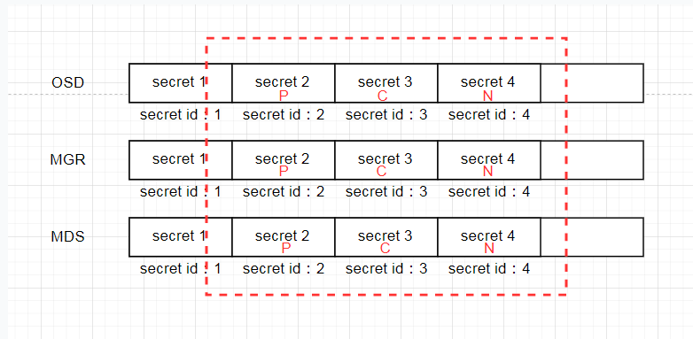
如果current rotate secret超时时间比当前时间小，就过期了，需要创建一个新的rotate secret，原来的current变成pre，原来的next变成current，新生成的就是next，而且一个server的rotate secret永远只保留三个，如下图
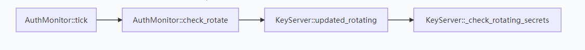

- 回复monc
monc会根据service id到monitor来请求service secret，monitor会根据service id从rotate secrets中找到属于这个service的所有rotate secret，然后根据当前的时间返回目前没有过期的一个service secret。
这样把service secret返回给monc，这里返回的service secret是这样的，这里以rados client为例
```
返回auth service secret，这里以keyring的key进行加密
返回mon service secret，这里以monitor生成的session key进行加密
返回osd service secret，这里以monitor生成的session key进行加密
返回mgr service secret，这里以monitor生成的session key进行加密
返回auth service secret，这里以monitor生成session key进行加密
```
这里可以看到auth返回了两次，但是使用的加密key不一样，第一个auth是monitor自动加上的，第二个auth才是monc要求要的。
#### 2.1.3.5 monc 接受rotate secret返回
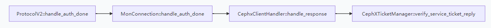
对收到的service secret用相应的key进行解密，如果不能解密就表示认证失败，从这里我们可以看出ceph的认证其实就是用key对rotate secret进行加密传输，看monc能不能进行解密。

这里我们就完成了认证，我们用图再来总结一下
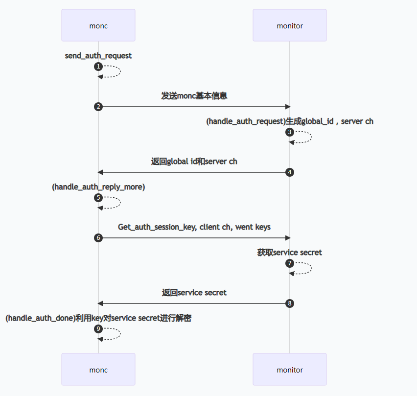

## 2.2 OSD启动
上面2.2是rados client的启动，OSD内部也是包含了一个monc，如果把OSD启动分两部分，第一部分跟rados client的monc一样，第二部分是rados client这类客户端所没有，就是在finish auth之后需要从monitor把属于自己的service secret获取回来，用于后面类似rados client和ceph-fuse进行访问。
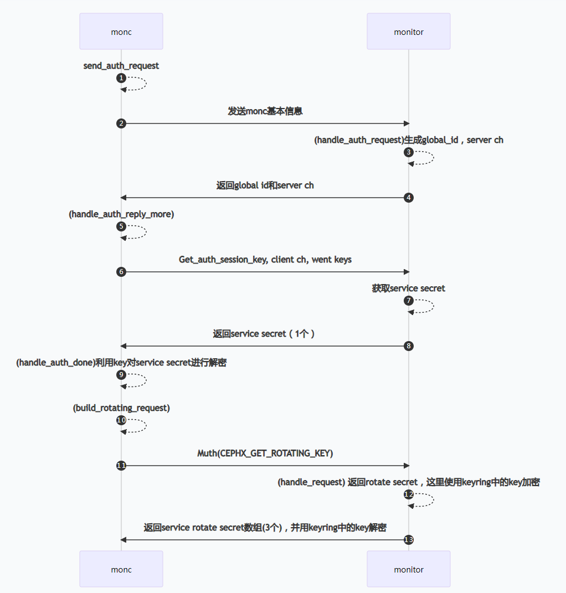
这里就是类似OSD、MDS等service服务启动的流程。

# 3. service服务访问篇
客户端rados client在通过monc认证之后，获取到了各个service secret，那如果我们要访问osd这个server怎么使用这个获取的service secret。我们知道如果要跟osd进行连接，需要osd的客户端，rados client中除了包含monc之外，还包括mgrc、objecter，这里的objecter模块就是跟osd交互的客户端。如果要跟osd进行交互肯定也是要先创建连接。跟之前monc和monitor之间的连接一样，都是在tcp三次握手之上再增加了自己的协议，如下
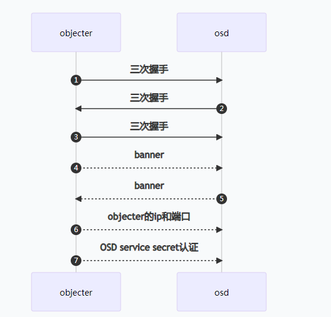
这里跟monc和monitor连接一样也有auth认证，而且认证的处理流程也是一样的，只是处理的内容不太一样，monc和monitor之间只要要获取各个service secret，而objecter和osd之间主要是用之前获取到的OSD service secret来进行验证。objecter在op发送给osd的时候会进行连接创建
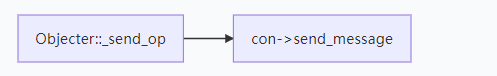
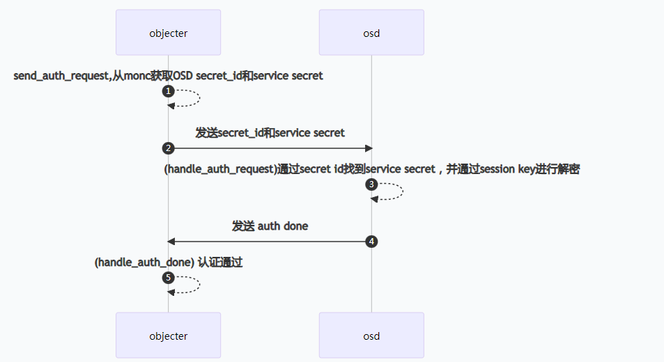
认证通过完等连接建立之后就可以发送op到osd了。

# 4. rados client、monitor和osd通信篇
通过上面之后我们总结一下rados client、monitor和osd之间的交互
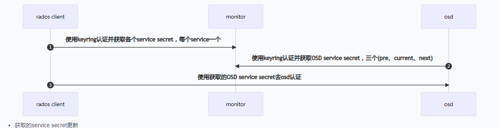

- 获取的service secret更新
我们前面讲过service secret是从mon的authmonitor的rotate secrets获取，authmonitor通过ticket定时更新，而radosclient和osd在连接建立的时候通过向mon获取，那rados client和OSD的service secret何时更新呢，都在他们的tick中
（1）rados client更新
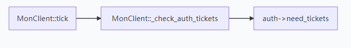
过期了就向monitor发送消息获取新的service secret
（2）osd更新
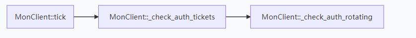
过期了就向monitor发送消息获取新的service secret


# 参考
[深度解析CephX原理—调节NTP时钟的困境](https://hackerain.me/2019/12/15/ceph/cephx.html)
