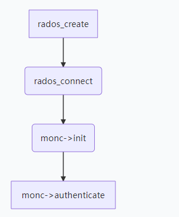
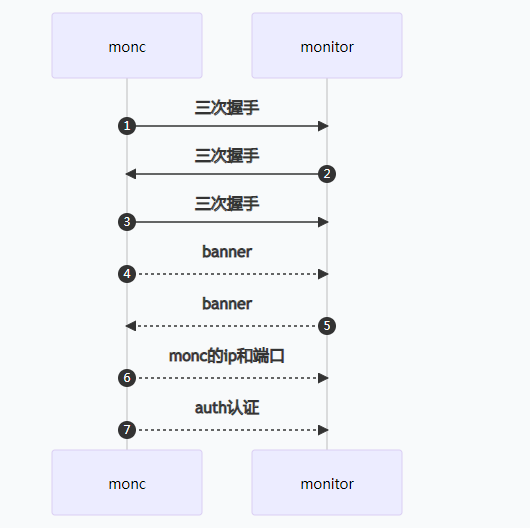

# glance对接cinder
————————————————————————————————————————————————————————————————————————————
glance-api.conf修改
```
default_store = cinder
stores = cinder
```

cinder.conf修改
```
glance_api_version = 2
allowed_direct_url_schemes = cinder
image_upload_use_cinder_backend = True
image_upload_use_internal_tenant = True
```

# 对接结果
————————————————————————————————————————————————————————————————————————————
- glance 数据库


- ceph中的显示

